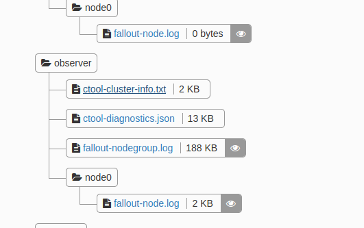

<!--
Licensed to the Apache Software Foundation (ASF) under one
or more contributor license agreements.  See the NOTICE file
distributed with this work for additional information
regarding copyright ownership.  The ASF licenses this file
to you under the Apache License, Version 2.0 (the
"License"); you may not use this file except in compliance
with the License.  You may obtain a copy of the License at

  http://www.apache.org/licenses/LICENSE-2.0

Unless required by applicable law or agreed to in writing,
software distributed under the License is distributed on an
"AS IS" BASIS, WITHOUT WARRANTIES OR CONDITIONS OF ANY
KIND, either express or implied.  See the License for the
specific language governing permissions and limitations
under the License.
-->

# How to run the Driver duration tests

Note: the procedure described in this page is currently only accessible to DataStax employees.

## Overview

A duration test applies a constant, pre-defined load to the cluster for an extended period of time,
typically 2 or 3 days, while also generating some chaos by randomly restarting nodes. The load is
a mix of reads, writes, and deletes.

Duration tests are useful to detect performance regressions between 2 different driver versions.

The Java Driver duration tests are stored in a [private
repository](https://github.com/riptano/driver-examples/tree/java-driver-4.x/java/durationTest/)
accessible only to DataStax employees.

A duration test executes in an infinite loop the following actions:

1. Confirm row does not exist
2. Write row
3. Confirm read of row
4. Delete row
5. Confirm row does not exist

The actions are performed randomly via SimpleStatements, BatchStatements (except on reads), and
PreparedStatements.

## Running the duration tests on DataStax Fallout

DataStax internal Fallout server has modules that allow to automate running and monitoring duration
tests.

### Step 0: Set up a Graphite server

1. If you haven't done this yet, create a new Fallout test based on the [graphite-setup.yaml] 
   template.
2. Run the test and wait for its successful completion.
    * Choose a `keep_alive` parameter that is large enough to run all the planned duration tests. 
      E.g. if you intend to run duration tests for 10 days, set this parameter to a value greater 
      than or equal to `10d`. The default is 15 days.
3. Obtain the IP of the Graphite server:
    * Navigate to the test artifacts. The IP can be found in the `ctool-cluster-info.txt` file of 
      the server group:
      
    * Log in to the Graphite server to check that the server was correctly set up: 
      `http://<graphite_server_ip>:3000` (VPN required).
      The username/password is Graphite's default: `admin/admin`. 
      
Two Grafana dashboards should be loaded automatically:

* `Java Driver 4 Duration Test Metrics (aggregate)`: provides high-level information such as
  the number of completed tests per minute. Useful to compare different test runs.
* `Java Driver 4 Duration Test Metrics (focus)`: provides detailed information for one specific
  test run. Can be useful to drill down on issues encountered during the test, or to inspect
  latencies, throughput, etc.

If the above Grafana dashboards are not loaded for some reason, they can be found in this [private
repository](https://github.com/riptano/testeng-devtools/tree/master/duration-tests/java/grafana).

### Steps 1 to N: Run duration tests and compare results

1. If you haven't done this yet, create a new Fallout test based on the [duration-test.yaml] 
   template.
2. For each combination of server and driver that you wish to test, launch a distinct test run and 
   modify its parameters to match the desired scenario:
    * Change `server_type` and`server_version` to match the exact server you plan on testing 
      against;
    * Change `driver_rev` and `driver_label` to be whatever driver revision you are using (
      `driver_label` is merely for reporting purposes);
    * Don't forget to change the `graphite_host` parameter to match the Graphite server IP obtained
      in the previous step;
    * Finally, choose the desired duration (default is 2 days).
3. Run the test and monitor the performance on the Graphite server.

Once a test run is finished, the cluster and the client VMs are destroyed, but their logs are
conserved as test artifacts in Fallout.
