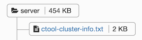

# How to run the Fallout performance tests

## Setup Graphite
 
1. Create a new test based on the [graphite-setup.yaml](graphite-setup.yaml) template.
2. Modify the parameters to match the scenario.
    * Change the dse_version to match one of the versions you plan on testing against
    * Change driver_oss_branch to be whatever branch of the driver you are using
    * Driver_examples_branch should stay java-driver-4.x
3. Run the graphite-setup test (wait for its successful setup) and get the graphite server address:
    * Navigate to running test, and obtain the ip from the observer node this will be used as a graphite server in the other tests. 
    The ip can be found in the `ctool-cluster-info.txt` file:
    
    * Login to the graphite server; the address should match the observer’s, the web interface is on port 3000. 
    The username/password is admin/admin
    * Dashboards will be loaded automatically.
    

## Start performance tests      

1. Create a new test based on the [oss-performance-setup.yaml](oss-performance-setup.yaml) template.
2. Change the parameters in the same manner as the first test, with the addition of the graphite_host parameter. 
Use the IP from the first cluster’s observer mode (the previous setup step).
3. Monitor the performance on the graphite observer host IP (taken from the Setup Graphite step)
   The performance tests will report metrics in the two dashboards:
    
    
